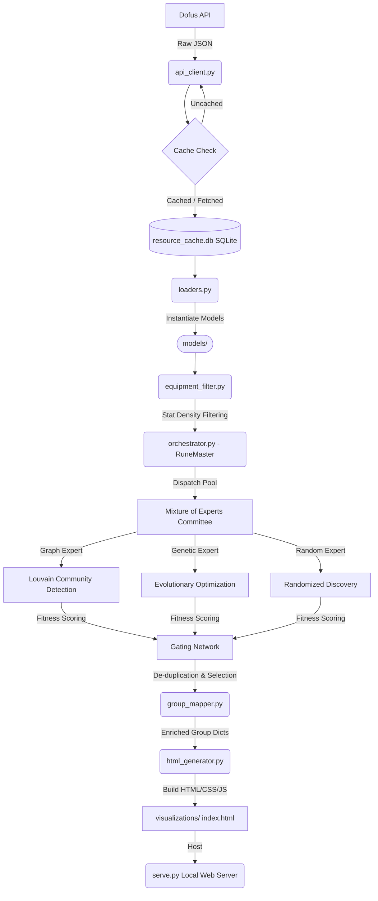

# 🔥 RuneMaster — Crafting Optimization & Group Discovery Engine

Welcome to **RuneMaster**, a specialized optimization engine for Dofus 3 crafting. It analyzes equipment recipes from the Dofus API, identifies overlapping resource footprints, and automatically discovers optimal groups of items to craft. By grouping items that share common ingredients, players and crafters can minimize farming overhead and streamline market purchases.

---

## 📖 Executive Summary & Core Mechanics

The engine ingests item databases and solves the grouping problem using mathematical similarity measures, optimization constraints, and a **Mixture of Experts (MoE)** architecture.



---

## 🧠 Core Algorithms & Mathematical Concepts

To build, extend, or interact with the project, you must understand its three mathematical and algorithmic pillars:

### 1. Recipe Similarity (Jaccard Index)
To determine if two equipment items $A$ and $B$ share similar crafting patterns, we compute the **Jaccard Similarity** over their recipe requirements (excluding common resource IDs):

$$\text{Jaccard}(A, B) = \frac{|R_A \cap R_B|}{|R_A \cup R_B|}$$

Where $R_A$ and $R_B$ represent the set of resource IDs required to craft items $A$ and $B$ respectively. Edges in the similarity graph are only drawn if:
- $\text{Jaccard}(A, B) \ge \text{graph\_min\_shared\_ratio}$
- $|R_A \cap R_B| \ge \text{graph\_min\_shared\_count}$

### 2. Stat Density Filtering
Rather than clustering all equipment, RuneMaster filters out weak items using **Stat Density**.
- Each item has an associated `stat_weight` computed from its effects using Dofus-specific coefficient weights (e.g. Action Points [PA] = 100, Vitality = 0.2) in [stat_calculator.py](file:///home/adamb/rune_master/processing/stat_calculator.py).
- **Stat Density** is calculated as:
  $$\text{Density} = \frac{\text{Stat Weight}}{\text{Level}}$$
- Items falling below the `min_equipment_density` threshold or density/level ratio are filtered out by [equipment_filter.py](file:///home/adamb/rune_master/processing/equipment_filter.py) to prevent optimizing for inefficient gear.

### 3. Mixture of Experts (MoE) Architecture
Discovered groups are generated by ensembling the results of multiple experts:
- **Deterministic (Graph Expert)**: Builds a similarity network of items and runs the Louvain community detection algorithm in [community_detector.py](file:///home/adamb/rune_master/processing/community_detector.py) to partition the network.
- **Genetic Expert**: A customized evolutionary algorithm in [genetic_expert.py](file:///home/adamb/rune_master/processing/experts/genetic_expert.py) that performs crossover and mutation on item pools to maximize cluster fitness.
- **Random Expert**: Generates random candidate groups to explore unmapped areas of the recipe space.
- **Gating Network (Orchestrator)**: Evaluates all candidate groups, applies fitness scoring, and de-duplicates groups that overlap by more than `dedup_overlap_threshold` (using Jaccard similarity of their equipment sets).

---

## 📁 Project Architecture & File Registry

Below is a detailed registry of the files in this project to help humans and models locate components instantly.

```
rune_master/
├── config.py
├── main.py
├── serve.py
├── Makefile
├── requirements.txt
├── data/
│   ├── api_client.py
│   ├── cache_manager.py
│   └── loaders.py
├── models/
│   ├── common.py
│   ├── equipment.py
│   ├── recipe.py
│   └── resource.py
├── processing/
│   ├── config_dataclass.py
│   ├── orchestrator.py
│   ├── graph_builder.py
│   ├── community_detector.py
│   ├── equipment_filter.py
│   ├── group_mapper.py
│   ├── stat_calculator.py
│   ├── tuner.py
│   └── experts/
│       ├── base.py
│       ├── graph_expert.py
│       ├── genetic_expert.py
│       └── random_expert.py
└── visualization/
    ├── html_generator.py
    ├── style_templates.py
    └── graph_generator.py
```

### 🗺️ Module & File Directory

| File / Module | Core Functionality | Key Symbols |
| :--- | :--- | :--- |
| **Root Level** | | |
| [main.py](file:///home/adamb/rune_master/main.py) | Main pipeline entry point. Configures, loads, processes, and spins up visualization dashboard. | `main()`, `load_equipment()`, `process_equipment()` |
| [config.py](file:///home/adamb/rune_master/config.py) | Top-level constants, API configurations, item selections, and grouping methods. | `Config` |
| [serve.py](file:///home/adamb/rune_master/serve.py) | Standalone visualization HTTP web server. Serves HTML outputs on port `8000`. | `start_server()`, `QuietHTTPRequestHandler` |
| [Makefile](file:///home/adamb/rune_master/Makefile) | Declarative build system for pipelines, serving, tuning, and cleanup. | `all`, `serve`, `compute`, `tune`, `clean` |
| **Data Layer** | [DATA.md](file:///home/adamb/rune_master/data/DATA.md) | |
| [data/api_client.py](file:///home/adamb/rune_master/data/api_client.py) | Communicates with the external API (`api.dofusdu.de`) to retrieve equipment and resources. | `DofusAPIClient` |
| [data/cache_manager.py](file:///home/adamb/rune_master/data/cache_manager.py) | Disk-backed SQLite storage featuring WAL mode for parallel, read-safe API caching. | `CacheManager` |
| [data/loaders.py](file:///home/adamb/rune_master/data/loaders.py) | Instantiates models from raw API dictionaries and caches calculated weights. | `EquipmentLoader`, `ResourceLoader` |
| **Model Layer** | [MODELS.md](file:///home/adamb/rune_master/models/MODELS.md) | |
| [models/equipment.py](file:///home/adamb/rune_master/models/equipment.py) | Defines the equipment data container, its attributes, and effects. | `Equipment`, `EquipmentStat` |
| [models/resource.py](file:///home/adamb/rune_master/models/resource.py) | Defines the resource/crafting ingredient data container. | `Resource` |
| [models/recipe.py](file:///home/adamb/rune_master/models/recipe.py) | Defines the requirements connecting equipment to ingredients. | `ResourceRequirement` |
| [models/common.py](file:///home/adamb/rune_master/models/common.py) | Holds global enums and types like item categories, stat weights, and API URL formats. | `StatWeight`, `ItemType` |
| **Processing Layer** | [PROCESSING.md](file:///home/adamb/rune_master/processing/PROCESSING.md) | |
| [processing/config_dataclass.py](file:///home/adamb/rune_master/processing/config_dataclass.py) | Holds all mathematical thresholds, limits, and algorithm configurations. | `ProcessingConfig` |
| [processing/orchestrator.py](file:///home/adamb/rune_master/processing/orchestrator.py) | Orchestration gating network that coordinates mixture of experts and de-duplicates overlaps. | `RuneMaster` |
| [processing/graph_builder.py](file:///home/adamb/rune_master/processing/graph_builder.py) | Constructs network graph representing similarities between items. | `GraphBuilder` |
| [processing/community_detector.py](file:///home/adamb/rune_master/processing/community_detector.py) | Computes Louvain communities and bipartite sub-graphs. | `CommunityDetector` |
| [processing/equipment_filter.py](file:///home/adamb/rune_master/processing/equipment_filter.py) | Implements density-level filters and checks item thresholds. | `EquipmentFilter` |
| [processing/group_mapper.py](file:///home/adamb/rune_master/processing/group_mapper.py) | Enrich clusters with statistics (coverage, recipe overlaps, crafting complexity). | `GroupMapper` |
| [processing/stat_calculator.py](file:///home/adamb/rune_master/processing/stat_calculator.py) | Normalizes equipment stat effects and calculates overall item stat weights. | `calculate_equipment_weight()` |
| [processing/tuner.py](file:///home/adamb/rune_master/processing/tuner.py) | Runs parameter grid-searches concurrently to find the best configuration. | `ParameterTuner` |
| **Grouping Experts** | | |
| [processing/experts/base.py](file:///home/adamb/rune_master/processing/experts/base.py) | Base class defining standard grouping interfaces and fitness evaluations. | `BaseGroupingExpert` |
| [processing/experts/graph_expert.py](file:///home/adamb/rune_master/processing/experts/graph_expert.py) | Graph expert utilizing Louvain modularity algorithm. | `GraphGroupingExpert` |
| [processing/experts/genetic_expert.py](file:///home/adamb/rune_master/processing/experts/genetic_expert.py) | Genetic algorithm expert doing crossovers/mutations on item populations. | `GeneticGroupingExpert` |
| [processing/experts/random_expert.py](file:///home/adamb/rune_master/processing/experts/random_expert.py) | Random grouping expert that produces diverse candidate configurations. | `RandomGroupingExpert` |
| **Visualization Layer** | [VISUALIZATION.md](file:///home/adamb/rune_master/visualization/VISUALIZATION.md) | |
| [visualization/html_generator.py](file:///home/adamb/rune_master/visualization/html_generator.py) | Compiles group statistics, item matrices, and D3 force graphs into static HTML. | `HTMLGenerator` |
| [visualization/style_templates.py](file:///home/adamb/rune_master/visualization/style_templates.py) | Stores CSS formatting and JS graphing assets embedded directly in HTML. | `CSS_TEMPLATE`, `JS_TEMPLATE` |

---

## 🛠️ Installation & Setup

1. **Virtual Environment Set Up**:
   ```bash
   python3 -m venv venv
   source venv/bin/activate
   ```

2. **Dependencies Installation**:
   ```bash
   pip install -r requirements.txt
   ```

3. **Verify Installation**:
   Verify everything runs correctly by launching the unit tests:
   ```bash
   pytest test/
   ```

---

## 🕹️ Command Reference (Makefile Targets)

Manage the pipeline easily with these target definitions:

| Command | Action |
| :--- | :--- |
| `make compute` | Run the processing pipeline without starting the visualization web server. |
| `make serve` | Start the visualization HTTP web server only (`http://127.0.0.1:8000/index.html`). |
| `make all` | Run the pipeline to compute new groups, then start the visualization web server. |
| `make dev` | Fast development run bypasses server initialization (`--no-serve`). |
| `make tune` | Launch parameter tuning engine using concurrent grid-search. |
| `make method METHOD=<name>` | Run pipeline with a specific grouping method (e.g. `deterministic`, `random`, `hybrid`, `committee`, `genetic`). |
| `make clean` | Remove caches, temporary run assets, and generated visualizations. |

---

## 🤖 Model / LLM Agent Guidelines

This section provides critical rules and design constraints to help LLM agents modify or extend this codebase without breaking system invariants.

### 📝 1. Configuration Division
- Do not mix configurations. Global constants (e.g. database path, language) live in [config.py](file:///home/adamb/rune_master/config.py).
- Algorithm parameters, mathematical thresholds, and model constraints live inside [processing/config_dataclass.py](file:///home/adamb/rune_master/processing/config_dataclass.py) under the `ProcessingConfig` dataclass.

### 💾 2. Cache Database & Concurrency
- The SQLite cache manager (`resource_cache.db`) is initialized with **WAL (Write-Ahead Logging)** mode enabled to allow parallel concurrent read access during multiprocessing tasks (e.g. in the grid-search tuning engine).
- **Hard Constraint**: Never write to the cache from multiple processes simultaneously. Writing is single-threaded and should only be performed during serial ingestion in [main.py](file:///home/adamb/rune_master/main.py#L66).

### 🏷️ 3. Model Immutability & Validation
- Models in [models/](file:///home/adamb/rune_master/models/) utilize the python `@dataclass` pattern. They have `unsafe_hash=False` (unfrozen) to allow setting derived computed fields (like `stat_weight`) after instantiation.
- Do not bypass validations in `__post_init__` checks. Quantities must always be positive; resource IDs must be non-negative.

### 🔬 4. Extending the Grouping Experts
To add a new grouping algorithm:
1. Subclass `BaseGroupingExpert` inside [processing/experts/base.py](file:///home/adamb/rune_master/processing/experts/base.py).
2. Implement `discover_groups(self, equipments, config, ...)` and `evaluate_group(self, group)`.
3. Register the new expert inside the `self.experts` dictionary inside `RuneMaster.__init__` in [processing/orchestrator.py](file:///home/adamb/rune_master/processing/orchestrator.py#L43).
